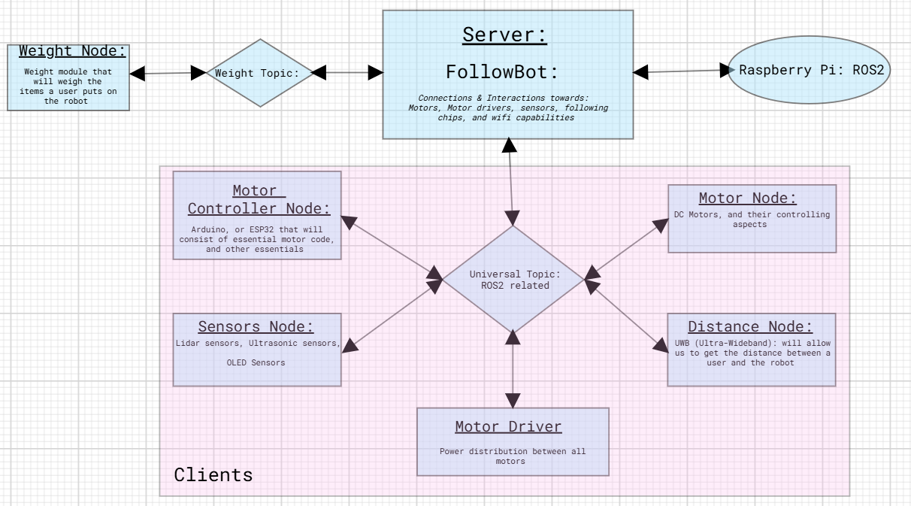
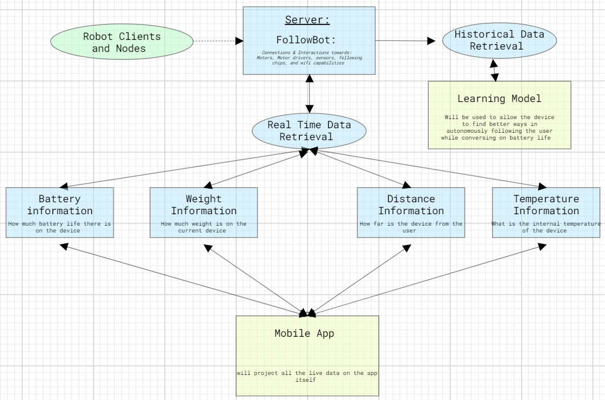
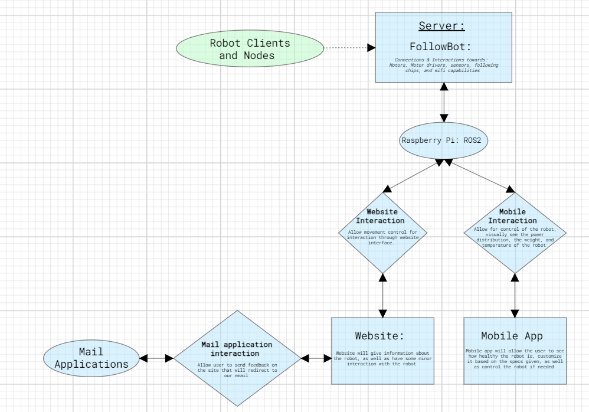

<h1>Software/Hardware Design Document  
for  
Follow Bot</h1>

<h2> Version 1.0 approved 
 
Prepared by Frank Vanris, Igor Janotti, Trong Duong, Joseph Hoang  
Bellevue College  
7/10/2024  </h2>

<h2>
1. Introduction    
</h2>

<h3> 1.1 Purpose  </h3>
This software/hardware design document describes the architecture and system design of the Follow Bot FollowBot as well as it's software, and how reliable and usable it will be for the user.  

<h3> 1.2 Scope   </h3>
The Goal for this FollowBot is for the user to be able to use it wherever they go while storing their belongings in a safe and reliable place. As well as map it to specific locations in order to bring items from place to place.  

<h3> 1.3 Overview  </h3>
The main gist of this document is to explain and express how the design for this software/hardware will be handled and to explain how the user will be able to use our software and hardware efficiently and reliably.  

<h3> 1.4 Reference Material   </h3>
Here are the given sources that were used to rely information for this document: 

* https://onlinelibrary.wiley.com/doi/10.1155/2022/8274455
* https://docs.ros.org/en/foxy/index.html
* https://docs.wpilib.org/en/stable/docs/hardware/hardware-basics/index.html
* https://docs.wpilib.org/en/stable/docs/software/hardware-apis/motors/index.html
* https://docs.arduino.cc/
* https://wiki.freecad.org/
* https://www.klipper3d.org/
* https://legacy.reactjs.org/docs/getting-started.html
* https://www.nature.com/articles/s41598-023-33837-1
* https://tinyurl.com/yc5y6r9x (AWS)
* https://scikit-learn.org/stable/ 

<h4> Books: </h4>

* Practical Robotics in C++ By *Lloyd Brombach*
* An Introduction to AI Robotics By *Robin Murphy*
* Introduction to Robotics: Mechanics and Control By *John J Craig*
* A Concise introduction to FollowBot Programming with ROS2 By *Francisco Rico Manrique*

<h3> 1.5 Definitions and Acronyms   </h3>

* ROS: Robotics Operating System

* DC: Direct Current

* AC: Alternating Current

* Nodes: A participant in the ROS2 Graph, which uses a client library to communicate with other nodes.

* Topics: one of the three main ways that nodes can communicate with one another is via topics.

* Foxy: A version of the ROS2, there are other versions such as Jammy, Jazzy, Humble, Iron, and others.

* Motor Drivers: control chips that are meant to run current through a number of motors.

* Motor Controller: Any Microcontroller that controls motors in general, such as Arduinos, ESP32's and AdaFruit controllers.

* AP: Access Points

* WiFi Triangulation: A way for wifi routers, to triangulate a position.

* Arduino: a microcontroller

* ESP32: a microcontroller
 

## 2. System Overview

### App

#### Goal
The goal is to have the app update you on specific features that the FollowBot contains such as battery, weight, temperature, distance, and much more. With the app you will be able to map the FollowBot to a specific location. Or call the FollowBot to come to your specific location. There are many applications that the app will bring, and much more to come after.

#### Requirements

- **Light and Dark Mode**  
  The app should support both light and dark themes for user interface customization.

- **FollowBot Mapping Feature**  
  The app will allow the FollowBot to go to a specific location, or traverse to your location.

- **FollowBot Status Updates**  
  The app will update the FollowBot's status every 30 seconds. The update will include:
  - Power level
  - Temperature
  - Weight of the FollowBot
  - Information on any movement issues related to the weight
  - Distance between the user and the FollowBot when it comes to following mechanics.

- **Distance Notifications**  
  The app will send notifications if the FollowBot gets too far away from the user.

**Damage Notifications**
 Notifications for any possible damages that occurred on the FollowBot. Such as movement control changes, Temperature unresponsive changes, weight unresponsive changes, and power unresponsive changes. As well as network unresponsive changes.

- **Controller Functionality**  
  The app will act as a controller for the FollowBots, using the touchscreen. 
  - Optionally, a game controller can be used if the touchscreen is not functional.

### Website

#### Goal
The goal of the website is to inform the users about what the FollowBot does and send queries back to the owners of the website. It will contain as well demo features that the user will be able to try out with their FollowBot. And the website will contain a forums page in order for users alike to ask questions that are related to FollowBot

#### Requirements

- **Technologies**  
  The website will be written in JavaScript, HTML, and CSS.

- **Light and Dark Mode**  
  The website will support both light and dark modes for user interface customization.

- **Pages**  
  The website will contain four main pages:
  
  1. **FollowBot**  
     - This page will include text and an embedded video from YouTube.
  
  2. **App**  
     - This page will include text, an embedded video from YouTube, and a link to download the app.
  
  3. **About Us**  
     - This page will include text and links to our work and social media profiles.
  
  4. **Feedback**  
     - This page will include a text area where users can provide feedback.
     - A private section for owners will be available to download and delete messages.
     - Consider using a database to store and manage feedback submissions.

  5. 

### Robotic Overview

#### Goal
The goal of the FollowBot is for it to carry up to 50 lbs of your belongings and follow the user while avoiding obstacles. FollowBot will also be able to map to a specific location as well as meet your specific position.

We will be experimenting with different kinds of motors, sensors, and modules to determine the best way for the FollowBot to follow the user while maneuvering through obstacles quickly. We also aim to create a device that keeps costs to a minimum, as well as find ways to have FollowBot map between two locations..
We will be experimenting with different kinds of motors, sensors, and modules to determine the best way for the FollowBot to follow the user while maneuvering through obstacles quickly. We also aim to create a device that keeps costs to a minimum.

#### Weight Carrying and Following
The user will be able to place various belongings within the device, such as food, electronics, books, sports items, clothing, and more. The FollowBot will be able to track the user based on it's 

#### Sensors
The FollowBot will use multiple sensors to avoid and move away from obstacles. Forms of avoidance will include lidar sensors, computer vision, and echo locative tracking. The choice of sensors will be decided as a team based on their accuracy in avoiding obstacles quickly.

#### Mapping
The FollowBot will be able to map out a path to a given location through API tools such as Google Maps, BC's directed Map API, and much more.
The FollowBot will use multiple sensors to avoid and move away from obstacles. Forms of avoidance will include lidar sensors, computer vision, and echo locative tracking. The choice of sensors will be decided as a team based on their accuracy in avoiding obstacles quickly.

#### Hardware
When designing the hardware, cost will be a key consideration. Initially, hardware will be created through 3D printing and simple woodworking. Designing the hardware will be done using various design applications such as FreeCAD, Fusion360, and Blender. For electronic hardware development and wiring, the final design will be created via a PCB manufacturer.

#### Real-Time Updates
Through the mobile app, the FollowBot will provide real-time updates on battery life, distance between the user and the FollowBot, the temperature within the FollowBot's capsule, and the weight distribution on the FollowBot. Notifications will be sent to the user if the battery life is low or if the FollowBot needs help or repair.

#### Machine Learning Models
We aim to add machine learning to the FollowBot. The capability for the FollowBot to learn from its mistakes through reinforcement learning could be beneficial in improving performance while conserving battery life. Our goal is to maximize battery life so the FollowBot can be used daily without frequent charging. As well as finding best possible paths to better improve the following mechanics of FollowBot.

#### Authentication/Security
We plan to add an authentication process when initializing the FollowBot on the user's account through the mobile app and the website. Each FollowBot will have a unique secure number configuration that cannot be changed. This configuration will only need to be done once.

#### Cost
We aim to keep the price range for the FollowBot under $500, ideally under $300. The device should be stable, useful, and beneficial to the consumer. The cost should attract consumers to buy our product. Our goal is to ensure the device is worth their money and to exceed their expectations.

###### UPDATE 

#### Demo GOALS
We aim to have multiple demos for FollowBot and  we consider FollowBot passing the demos as succesfully goal

### Demo 1
First demo getting information from FollowBot, 

### Demo 2
Second demo controlling the FollowBot from using website,

### Demo 3
Third demo moving circle while avoiding obsticles

<h2>3. Robotic Architecture</h2>

*FollowBot Architecture*

*Data Retrieval for app and learning model*
 
 <h2>3. Systems Architecture:</h2>

*Mapping*

*Interaction between website app and FollowBot*

*Interaction between website app and FollowBot*

*Authentication process for FollowBot *

*Authentication process for FollowBot*

<h2>Architectural Design for both Robotic and System sides: </h2>

<h3> FollowBot Architectural Design </h3>

<h4> 3.1 FollowBot Architecture </h4>
1. FollowBot Server:

  * FollowBot server takes place within the ROS2 Raspberry Pi.
  * allows information back and forth between client nodes.

2. Universal Topic:
    
    * Universal topic allows for message transferring and message retrieving between client and server nodes.

3. Client Nodes:

    a. Motor Controller Node:

        * Control motor movement and allow for mathematical calculations between movements between a point to another point
    
    b. Sensors Node:
        
        * Object detection, and avoidance sensors such as Lidar, supersonic
        and others. Messaging server when close to object or far from object.
    
    c. Motor Driver Node:

        * Allows control for the motors and will allow speed control for the motor controller as well as battery life control.
    
    d. Distance Node:

        * This will allow for identifying the distance between a point to another point in space.

    e. Motor Node:

        * Motor control and power supply to the motors itself.

4. External Weight Node:
    * This node is seperate from the others because this will instantly connect to the mobile device in order to give live data of how much weight is being stored on the device itself.
  

<h4>Data Retrieval and Learning Model Architecture </h4>

1. FollowBot Client:
1. FollowBot Server:

    * FollowBot client takes place in the FollowBot 
    * A python server is used to send information back and forth between the user and the FollowBot.

2. Real Time Data Retrieval:
    * A method that will be used to obtain live data from the FollowBot.
    * live data varies from battery life, to weight gain.

3. Data:
    
    **Battery Information**: Will give you how much battery is left in the system.

    **Weight Information**: Will give you the amount of weight that is being stored on the system.

    **Distance Information**: Will give the proximity and distance between you and the FollowBot.

    **Temperature Information**: Will give you the interior temperature of where you are storing your items. Will be beneficial due to the fact that people are buying groceries and do not want their items to get spoiled.

4. Mobile App:
    * Will visually show the real time data to the user when they are using the app as well as allow the user to direct itself from point A to B from a Map.
  
5. Learning Model:
    * Will be used to take in past data of the FollowBot  in order to find better ways to correct it's movement properly so it can easily, safely, and quickly follow you while trying to reduce battery consumption. 
    * Will be used to take in past data of the FollowBot in order to find better ways to correct it's movement properly so it can easily, safely, and quickly follow you while trying to reduce battery consumption.
  

<h3> 3.1 Systems Architectural Design </h3>

<h4> Mobile and Web Application Interaction </h4>

1. Server AWS:
    * We know that this will consist of all the connections to the client nodes, but it will also connect between the mobile app and the website itself.
  
2. ROS2 Raspberry Pi or Microcontroller:
    * This device consists of all the fundamental backends in order to connect to the Server which will connect to the website and mobile app. Mapping features will be also added as well.

3. Website interaction:
    * Backend to frontend interaction between the website server and FollowBot and vice versa.
    * With the website you will be able to also control the FollowBot itself by connecting to it if it is yours.

4. Website:
    * The website will consist of reliable information about the FollowBot as well as have some minor interaction with the FollowBot.

5. Mobile interaction:
    * Backend to frontend interaction between the mobile app and the Raspberry pi
    * The mobile app will have the main control over the FollowBot itself, and will display reliable information about the FollowBot

6. Mobile App:
    * You will be able to interact with the FollowBot through a mobile interface. It will allow you to see certain specs such as battery, temperature, weight, and distance. You will also be able to control the FollowBot if needed.

7. Mail Application interaction:
    * There will be an interaction from frontend to frontend for for sending information to users who have purchased FollowBot. Updates will correlate to mobile related features, FollowBot related features, and much more.

8. Mail Application:
    * The owner of the website will recieve emails from users that use the feedback page on the website. This will allow owners of the website to gain reliable information based on issues or future add-ons for the FollowBot.

9. Forums Page:
    * Users will be able to open the forums page in order to ask questions or look up questions that are related to FollowBot. Users will be able to communicate with one another, answer questions from one another, and upvote answers to questions based on how reliable they are.
  
  

<h4> Authentication Process </h4>

1. AWS Server:
1. FollowBot Server:

    * The Server will take place on a AWS instance EC2.
    * Allows information back and forth between client nodes, website, and mobile app.
    * FollowBot server takes place within the ROS2 Raspberry Pi.
    * Allows information back and forth between client nodes.

2. FollowBot  Authentication Key:
    * A 16 number/character key meant for every FolloBobot.
2. FollowBot Authentication Key:
    * A 16 number/character key meant for every FollowBot.
    * Every key will be different from the last. 

3. Mobile App/Website Authentication:
    a. You will input a username.
    b. You will input a password.

4. Authentication process:
    * the combination of the FollowBots key as well as the users password and username will allow them to be authenticated for the use of the FollowBot  and for special offers as well as access towards the guides, feedback page, and support page.
    * the combination of the FollowBots key as well as the users password and username will allow them to be authenticated for the use of the FollowBot and for special offers as well as access towards the guides, feedback page, and support page.

5. Database:
  * The database will be used to store the FollowBots keys, passwords, and usernames of users that are subscribed to the product. The database will be a way of making sure certain keys are not the same from one another as well as passwords and usernames.

  

<h4> Mapping process </h4>

1. BC Mapping API:
    * We will potentially use the BC map in order to determine the best possible path to a location for the FollowBot
    * The map will allow FollowBot to go to different locations on BC

2. Google Maps:
    * Google maps will allow for full access of mapping for the FollowBot. It will allow FollowBot to go to specific locations from point A to point B.

3. Database:
    * We will contain a Database that will potentially contain most University Campuses maps in order to traverse from point A to point B.
  

### 3.2 FollowBot Decomposition Architectural Design

#### FollowBot Architecture

1. **FollowBot Server**
    - **Description**: The FollowBot Server operates within the ROS2 Raspberry Pi and facilitates communication between client nodes.
    - **Subsystem Model**:
      - **Class**: `RobotServer`
      - **Attributes**: `serverID`, `status`
      - **Methods**: `initialize()`, `sendMessage()`, `receiveMessage()`
    - **Interface Specifications**:
      - **Interfaces**: `ICommunication`
      - **Methods**: `sendMessage()`, `receiveMessage()`
  

2. **Universal Topic**
    - **Description**: The Universal Topic enables message transfer and retrieval between client and server nodes.
    - **Subsystem Model**:
      - **Class**: `UniversalTopic`
      - **Attributes**: `topicID`, `messageQueue`
      - **Methods**: `publishMessage()`, `subscribe()`
    - **Interface Specifications**:
      - **Interfaces**: `ITopic`
      - **Methods**: `publishMessage()`, `subscribe()`
  
3. **Client Nodes**

  a. **Motor Controller Node**

  - **Description**: Controls motor movement and performs mathematical calculations for movement between points.
      
  - **Subsystem Model**:
    - **Class**: `MotorControllerNode`
    - **Attributes**: `controllerID`, `currentPosition`, `targetPosition`
    - **Methods**: `calculatePath()`, `moveToTarget()`
  - **Interface Specifications**:
    - **Interfaces**: `IMotorControl`
    - **Methods**: `calculatePath()`, `moveToTarget()`

  b. **Sensors Node**
      
  - **Description**: Handles object detection and avoidance using sensors like Lidar and supersonic sensors.
  - **Subsystem Model**:
    - **Class**: `SensorsNode`
    - **Attributes**: `sensorID`, `objectDistance`
    - **Methods**: `detectObject()`, `sendAlert()`
  - **Interface Specifications**:
    - **Interfaces**: `ISensor`
    - **Methods**: `detectObject()`, `sendAlert()`

  c. **Motor Driver Node**

  - **Description**: Controls the motors, including speed and battery life management.

  - **Subsystem Model**:
    - **Class**: `MotorDriverNode`
    - **Attributes**: `driverID`, `motorSpeed`, `batteryLevel`
    - **Methods**: `controlSpeed()`, `monitorBattery()`
  - **Interface Specifications**:
      - **Interfaces**: `IMotorDriver`
      - **Methods**: `controlSpeed()`, `monitorBattery()`

  d. **Distance Node**

  - **Description**: Identifies the distance between points in space.

  - **Subsystem Model**:
    - **Class**: `DistanceNode`
    - **Attributes**: `distanceID`, `startPoint`, `endPoint`
    - **Methods**: `calculateDistance()`
  - **Interface Specifications**:
    - **Interfaces**: `IDistance`
    - **Methods**: `calculateDistance()`

  e. **Motor Node**

  - **Description**: Manages motor control and power supply.
      
  - **Subsystem Model**:
    - **Class**: `MotorNode`
    - **Attributes**: `motorID`, `powerSupply`
    - **Methods**: `controlMotor()`
  - **Interface Specifications**:
    - **Interfaces**: `IMotor`
    - **Methods**: `controlMotor()`

  f. **External Weight Node**
    
    - **Description**: Connects to a mobile device to provide live data on the weight being stored on the device.
    - **Subsystem Model**:
      - **Class**: `ExternalWeightNode`
      - **Attributes**: `weightID`, `currentWeight`
      - **Methods**: `connectToDevice()`, `sendWeightData()`
    - **Interface Specifications**:
      - **Interfaces**: `IWeight`
      - **Methods**: `connectToDevice()`, `sendWeightData()`

  

#### Data Retrieval and Learning Model Architecture

1. **AWS Server**
    - **Description**: The FollowBot  Server operates within the AWS Instance and facilitates communication between client nodes.
1. **FollowBot Server**
    - **Description**: The FollowBot Server operates within the ROS2 Raspberry Pi and facilitates communication between client nodes.
    - **Subsystem Model**:
      - **Class**: `AWSServer`
      - **Attributes**: `serverID`, `status`
      - **Methods**: `initialize()`, `sendMessage()`, `receiveMessage()`
    - **Interface Specifications**:
      - **Interfaces**: `ICommunication`
      - **Methods**: `sendMessage()`, `receiveMessage()`

2. **Real Time Data Retrieval**
    - **Description**: A method used to obtain live data from the FollowBot. The live data varies from battery life to weight gain and more.
    - **Description**: A method used to obtain live data from the FollowBot. The live data varies from battery life to weight gain.
    - **Subsystem Model**:
      - **Class**: `RealTimeDataRetrieval`
      - **Attributes**: `dataID`, `batteryLife`, `weightGain`, `timestamp`
      - **Methods**: `retrieveBatteryLife()`, `retrieveWeightGain()`, `updateTimestamp()`
    - **Interface Specifications**:
      - **Interfaces**: `IDataRetrieval`
      - **Methods**: `retrieveBatteryLife()`, `retrieveWeightGain()`, `updateTimestamp()`

3. **Data**
    - **Description**: Provides various types of information about the FollowBot.
    - **Subsystem Model**:
      - **Class**: `Data`
      - **Attributes**: `batteryInfo`, `weightInfo`, `distanceInfo`, `temperatureInfo`
      - **Methods**: `getBatteryInfo()`, `getWeightInfo()`, `getDistanceInfo()`, `getTemperatureInfo()`
    - **Interface Specifications**:
      - **Interfaces**: `IData`
      - **Methods**: `getBatteryInfo()`, `getWeightInfo()`, `getDistanceInfo()`, `getTemperatureInfo()`

4. **Mobile App**
    - **Description**: Visually shows the real-time data to the user when they are using the app.
    - **Subsystem Model**:
      - **Class**: `MobileApp`
      - **Attributes**: `appID`, `realTimeData`
      - **Methods**: `displayRealTimeData()`
    - **Interface Specifications**:
      - **Interfaces**: `IMobileApp`
      - **Methods**: `displayRealTimeData()`

5. **Learning Model**
    - **Description**: Takes in past data of the FollowBot to find better ways to correct its movement, ensuring it can follow you easily, safely, and quickly while reducing battery consumption.
    - **Subsystem Model**:
      - **Class**: `LearningModel`
      - **Attributes**: `modelID`, `pastData`
      - **Methods**: `analyzeData()`, `optimizeMovement()`
    - **Interface Specifications**:
      - **Interfaces**: `ILearningModel`
      - **Methods**: `analyzeData()`, `optimizeMovement()`

6. **Mapping**
    - **Description**: Allows FollowBot to go from point A to point B from a Map that is saved on the Database.
    - **Subsystem Model**:
      - **Class**: `Mapping`
      - **Attributes**: `mappingID`, `mapData`
      - **Methods**: `obtainMap()`, `obtainMapPositionA()`, `obtainMapPositionB()`
    - **Interface Specifications**:
      - **Interface**: `IMapping`
      - **Methods**: `obtainMap()`, `obtainMapPositionA()`, `obtainMapPositionB()`

### 3.2 Systems Decomposition Architectural Design

#### Mobile and Web Application Interaction

1. **Server AWS**
    - **Description**: Consists of all the connections to the client nodes and connects the mobile app and the website.
    - **Subsystem Model**:
      - **Class**: `ServerAWS`
      - **Attributes**: `awsID`, `status`
      - **Methods**: `connectToClientNodes()`, `connectToMobileApp()`, `connectToWebsite()`
    - **Interface Specifications**:
      - **Interfaces**: `IConnection`
      - **Methods**: `connectToClientNodes()`, `connectToMobileApp()`, `connectToWebsite()`

2. **ROS2 Raspberry Pi Or Microcontroller**
    - **Description**: Contains all the fundamental backends to connect to the website and the mobile app.
    - **Subsystem Model**:
      - **Class**: `ROS2RaspberryPi`or `Arduino`
      - **Attributes**: `deviceID`, `backendStatus`
      - **Methods**: `initializeBackend()`, `connectToWebsite()`, `connectToMobileApp()`
    - **Interface Specifications**:
      - **Interfaces**: `IBackend`
      - **Methods**: `initializeBackend()`, `connectToWebsite()`, `connectToMobileApp()`

3. **Website Interaction**
    - **Description**: Backend to frontend interaction between the website to server to Raspberry Pi or Microcontroller. Allows control of the FollowBot if nearby.
    - **Description**: Backend to frontend interaction between the website and the Raspberry Pi. Allows control of the FollowBot if nearby.
    - **Subsystem Model**:
      - **Class**: `WebsiteInteraction`
      - **Attributes**: `interactionID`, `websiteStatus`
      - **Methods**: `backendToFrontend()`, `controlRobot()`
    - **Interface Specifications**:
      - **Interfaces**: `IWebsiteInteraction`
      - **Methods**: `backendToFrontend()`, `controlRobot()`

4. **Website**
    - **Description**: Provides reliable information about the FollowBot and allows minor interaction with the FollowBot.
    - **Subsystem Model**:
      - **Class**: `Website`
      - **Attributes**: `websiteID`, `content`
      - **Methods**: `displayInfo()`, `interactWithRobot()`
    - **Interface Specifications**:
      - **Interfaces**: `IWebsite`
      - **Methods**: `displayInfo()`, `interactWithRobot()`

5. **Mobile Interaction**
    - **Description**: Backend to frontend interaction between the mobile app, server and the Raspberry Pi or Microcontroller. The mobile app has main control over the FollowBot.
    - **Subsystem Model**:
      - **Class**: `MobileInteraction`
      - **Attributes**: `interactionID`, `mobileStatus`
      - **Methods**: `backendToFrontend()`, `controlRobot()`
    - **Interface Specifications**:
      - **Interfaces**: `IMobileInteraction`
      - **Methods**: `backendToFrontend()`, `controlRobot()`

6. **Mobile App**
    - **Description**: Allows interaction with the FollowBot through a mobile interface. Displays specs like battery, temperature, weight, and distance. Allows control of the FollowBot.
    - **Subsystem Model**:
      - **Class**: `MobileApp`
      - **Attributes**: `appID`, `specs`
      - **Methods**: `displaySpecs()`, `controlRobot()`
    - **Interface Specifications**:
      - **Interfaces**: `IMobileApp`
      - **Methods**: `displaySpecs()`, `controlRobot()`

7. **Mail Application Interaction**
    - **Description**: Frontend to frontend interaction for sending messages through email to the website owner.
    - **Subsystem Model**:
      - **Class**: `MailAppInteraction`
      - **Attributes**: `interactionID`, `emailStatus`
      - **Methods**: `sendEmail()`
    - **Interface Specifications**:
      - **Interfaces**: `IMailInteraction`
      - **Methods**: `sendMail()`

8. **Mail Application**
    - **Description**: The website owner receives emails from users using the feedback page. Provides reliable information based on issues or future add-ons for the FollowBot.
    - **Subsystem Model**:
      - **Class**: `MailApplication`
      - **Attributes**: `mailID`, `feedback`
      - **Methods**: `receiveEmail()`, `processFeedback()`
    - **Interface Specifications**:
      - **Interfaces**: `IMailApplication`
      - **Methods**: `recieveEmail()`, `processFeedback()`

#### Authentication Process

1. **FollowBot Authentication Key**
    - **Description**: A 16 number/character key meant for every FollowBot. Every key will be different from the last.
    - **Subsystem Model**:
      - **Class**: `RobotAuthKey`
      - **Attributes**: `keyID`, `keyValue`
      - **Methods**: `generateKey()`, `validateKey()`
    - **Interface Specifications**:
      - **Interfaces**: `IAuthKey`
      - **Methods**: `generateKey()`, `validateKey()`

2. **Mobile App/Website Authentication**
    - **Description**: Authentication process involving username and password input.
    - **Subsystem Model**:
      - **Class**: `AuthProcess`
      - **Attributes**: `username`, `password`
      - **Methods**: `inputUsername()`, `inputPassword()`
    - **Interface Specifications**:
      - **Interfaces**: `IAuthProcess`
      - **Methods**: `inputUsername()`, `inputPassword()`

3. **Authentication Process**
    - **Description**: Combines the FollowBot’s key with the user’s password and username for authentication.
    - **Subsystem Model**:
      - **Class**: `Authentication`
      - **Attributes**: `authID`, `robotKey`, `userCredentials()`
      - **Methods**: `authenticateUser()`, `grantAccess()`
    - **Interface Specifications**:
      - **Interfaces**: `IAuthentication`
      - **Methods**: `authenticateUser()`, `grantAccess()`

3. **Database**
    - **Description**: Stores FollowBot keys, passwords, and usernames of users subscribed to the product. Ensures unique keys, passwords, and usernames.
    - **Description**: Stores FollowBot keys, passwords, and usernames of users subscribed to the product. Ensures unique keys, passwords, and usernames.
    - **Subsystem Model**:
      - **Class**: `Databse`
      - **Attributes**: `dbID`, `userData`
      - **Methods**: `storeData()`, `retrieveData()`
    - **Interface Specifications**:
      - **Interfaces**: `IDatabase`
      - **Methods**: `storeData()`, `retrieveData()`

#### Mapping Process

1. **BC Mapping API**
    - **Description**: We will potentially use the BC map to determine the best possible path to a location for the FollowBot.
    - **Subsystem Model**:
        - **Class**: `BCMappingAPI`
        - **Attributes**: `mapData`, `locationPoints`
        - **Methods**: `getOptimalPath()`, `navigateToLocation()`
    - **Interface Specifications**:
        - **Interfaces**: `IMappingAPI`
        - **Methods**: `getOptimalPath()`, `navigateToLocation()`

2. **Google Maps**
    - **Description**: Google Maps will allow for full access to mapping for the FollowBot. It will enable FollowBot to go to specific locations from point A to point B.
    - **Subsystem Model**:
        - **Class**: `GoogleMapsAPI`
        - **Attributes**: `startPoint`, `endPoint`
        - **Methods**: `getDirections()`, `calculateRoute()`
    - **Interface Specifications**:
        - **Interfaces**: `IMappingAPI`
        - **Methods**: `getDirections()`, `calculateRoute()`

3. **Database**
    - **Description**: A Database that will potentially contain most University Campuses' maps to traverse from point A to point B.
    - **Subsystem Model**:
        - **Class**: `CampusMapDatabase`
        - **Attributes**: `campusMapData`, `mapID`
        - **Methods**: `storeMap()`, `retrieveMap()`
    - **Interface Specifications**:
        - **Interfaces**: `IDatabase`
        - **Methods**: `storeMap()`

<h2> 3.3 Design Rationale </h2>
We chose this architecture because we needed something modulus in order to do things properly for the scope of our project. When it comes to the authentication process it was tedious in knowing how we would come about it, but we knew that if we made it modular it would make it less tedious in our side. The way we did it is by creating a Database that the authenticator would interact with in order to generate keys for the FollowBot that would not create replicas based on the ones that are currently on the database. That was one rationale that we chose for this project. 
  
Another is by keeping the ros2 system on the raspberry pi very interactive between many different pieces of hardware and software. With the ROS2 most of the functionalities that will be introduced will always have to be modulus in order for us to communicate between many different areas of hardware and software. Although we've been consistently using a Microcontroller so switching between the two will depend based on how much modular this project will become. No doubt it will become more modular based on the number of components we will be adding.
  
We also need to rely on the learning models and the mapping api's in order to see the improvements in following within FollowBot. We will also need to getting the Mapping algorithm working accordingly with the FollowBot  which is keeping an eye on it's surroundings.
  
The way we structured our decomposition above makes it easier for us to understand how we will simplify yet comprehend how our system should be.

    
<h2> 4.0 Data Design </h2>

<h3> 4.1 Data Description </h3>
When it comes to data and obtaining historical data for the machine learning model we will be using dataframes in order to store the data properly, ranging from battery life to weight distribution. When it comes to Databases the information will also be stored in a table of data. Other forms of data storing will be used in other applications when it comes to the FollowBot itself

<h3> 4.2 Data Dictionary </h3>

| Object|Attributes|Methods|
|-------|----------|-------|
| **Authentication**| `authID`: String,  `robotKey`: String,  `userCredentials`: Object| `authenticateUser()`, `grantAccess()`|
| **AuthProcess**| `username`: String,  `password`: String| `inputUsername()`,  `inputPassword()`|
| **Data**| `batteryInfo`: Float,  `weightInfo`: Float,  `distanceInfo`: Float,  `temperatureInfo`: Float| `getBatteryInfo()`,  `getWeightInfo()`,  `getDistanceInfo()`,  `getTemperatureInfo()`|
| **Database**| `dbID`: String,  `userData`: Object| `storeData()`,  `retrieveData()`|
| **DistanceNode**| `distanceID`: String,  `startPoint`: Object,  `endPoint`: Object| `calculateDistance()`|
| **ExternalWeightNode**| `weightID`: String,  `currentWeight`: Float| `connectToDevice()`,  `sendWeightData()`|
| **LearningModel**| `modelID`: String,  `pastData`: Object| `analyzeData()`,  `optimizeMovement()`|
| **MailAppInteraction**| `interactionID`: String,  `emailStatus`: String| `sendEmail()`|
| **MailApplication**| `mailID`: String,  `feedback`: Object| `receiveEmail()`,  `processFeedback()`|
| **MobileApp**| `appID`: String,  `specs`: Object| `displaySpecs()`,  `controlRobot()`|
| **MobileInteraction**| `interactionID`: String,  `mobileStatus`: String| `backendToFrontend()`,  `controlRobot()`|
| **MotorControllerNode**| `controllerID`: String,  `currentPosition`: Object,  `targetPosition`: Object | `calculatePath()`,  `moveToTarget()`|
| **MotorDriverNode**| `driverID`: String,  `motorSpeed`: Float,  `batteryLevel`: Float| `controlSpeed()`,  `monitorBattery()`|
| **MotorNode**| `motorID`: String,  `powerSupply`: Float| `controlMotor()`|
| **RealTimeDataRetrieval**| `dataID`: String,  `batteryLife`: Float,  `weightGain`: Float,  `timestamp`: DateTime| `retrieveBatteryLife()`,  `retrieveWeightGain()`,  `updateTimestamp()`|
| **FollowBottAuthKey**| `keyID`: String,  `keyValue`: String| `generateKey()`,  `validateKey()`|
| **AWSServer**| `serverID`: String,  `status`: String| `initialize()`,  `sendMessage()`,  `receiveMessage()`|
| **SensorsNode**| `sensorID`: String,  `objectDistance`: Float| `detectObject()`,  `sendAlert()`|
| **ServerAWS**| `serverID`: String,  `status`: String| `connectToClientNodes()`,  `connectToMobileApp()`,  `connectToWebsite()`|
| **UniversalTopic**| `topicID`: String,  `messageQueue`: Queue| `publishMessage()`,  `subscribe()`|
| **Website**| `websiteID`: String,  `content`: String| `displayInfo()`,  `interactWithRobot()`|
| **WebsiteInteraction**| `interactionID`: String,  `websiteStatus`: String| `backendToFrontend()`,  `controlRobot()`|

<h2> 5. Component Design </h2>

#### Authentication
- **authenticateUser()**
  - Input: `robotKey`, `userCredentials`
  - Process: Validate `robotKey` and `userCredentials`
  - Output: Authentication status

- **grantAccess()**
  - Input: Authentication status
  - Process: Check if authentication is successful
  - Output: Access granted or denied

#### AuthProcess
- **inputUsername()**
  - Input: `username`
  - Process: Store `username`
  - Output: get access to your account once password is in

- **inputPassword()**
  - Input: `password`
  - Process: Store `password`
  - Output: get access to your account

#### Data
- **getBatteryInfo()**
  - Input: Battery potentiometer counter
  - Process: Retrieve `batteryInfo`
  - Output: `batteryInfo`

- **getWeightInfo()**
  - Input: Weight measurer module
  - Process: Retrieve `weightInfo`
  - Output: `weightInfo`

- **getDistanceInfo()**
  - Input: UWB, Bluetooth, or GPS
  - Process: Retrieve `distanceInfo`
  - Output: `distanceInfo`

- **getTemperatureInfo()**
  - Input: Temperature module
  - Process: Retrieve `temperatureInfo`
  - Output: `temperatureInfo`

#### Database
- **storeData()**
  - Input: `userData`
  - Process: Store `userData` in database
  - Output: None

- **retrieveData()**
  - Input: Query
  - Process: Retrieve data from database
  - Output: `userData`

#### DistanceNode
- **calculateDistance()**
  - Input: `startPoint`, `endPoint`
  - Process: Calculate distance between `startPoint` and `endPoint`
  - Output: Distance

#### ExternalWeightNode
- **connectToDevice()**
  - Input: Device ID
  - Process: Establish connection to device
  - Output: Connection status

- **sendWeightData()**
  - Input: `currentWeight`
  - Process: Send `currentWeight` to device
  - Output: None

#### LearningModel
- **analyzeData()**
  - Input: `pastData`
  - Process: Analyze `pastData`
  - Output: Analysis results

- **optimizeMovement()**
  - Input: Analysis results
  - Process: Optimize FollowBot movement
  - Output: Optimized movement parameters

#### MailAppInteraction
- **sendEmail()**
  - Input: Email content
  - Process: Send email to website owner
  - Output: Owner recieves email from users message input

#### MailApplication
- **receiveEmail()**
  - Input: None
  - Process: Receive email from users
  - Output: Email content

- **processFeedback()**
  - Input: Email content
  - Process: Analyze feedback
  - Output: Feedback analysis

#### MobileApp
- **displaySpecs()**
  - Input: `specs`
  - Process: Display `specs` on mobile app
  - Output: None

- **controlFollowBot()**
  - Input: Control commands
  - Process: Send control commands to FollowBot
  - Output: FollowBot could move or follow a set of tasks

#### MobileInteraction
- **backendToFrontend()**
  - Input: Backend data
  - Process: Transfer data to frontend
  - Output: Data transfer successful or not

- **controlFollowBot()**
  - Input: Control commands
  - Process: Send control commands to FollowBot
  - Output: FollowBot executes those commands

#### MotorControllerNode
- **calculatePath()**
  - Input: `currentPosition`, `targetPosition`
  - Process: Calculate path from `currentPosition` to `targetPosition`
  - Output: Path

- **moveToTarget()**
  - Input: Path
  - Process: Move motor along path
  - Output: motor turns on in order to move towards target

#### MotorDriverNode
- **controlSpeed()**
  - Input: Speed value
  - Process: Adjust motor speed
  - Output: motors speed is adjusted

- **monitorBattery()**
  - Input: Battery potentiometer reading
  - Process: Monitor battery level
  - Output: `batteryLevel`

#### MotorNode
- **controlMotor()**
  - Input: Control commands
  - Process: Execute motor control commands
  - Output: motor commands are executed

#### RealTimeDataRetrieval
- **retrieveBatteryLife()**
  - Input: Battery potentiometer current data reading
  - Process: Retrieve current battery life
  - Output: `batteryLife`

- **retrieveWeightGain()**
  - Input: Weight Module
  - Process: Retrieve current weight gain
  - Output: `weightGain`

- **updateTimestamp()**
  - Input: None
  - Process: Update timestamp of data retrieval
  - Output: `timestamp`

#### FollowBotAuthKey
- **generateKey()**
  - Input: None
  - Process: Generate a new authentication key
  - Output: `keyValue`

- **validateKey()**
  - Input: `keyValue`
  - Process: Validate the authentication key
  - Output: Validation status

#### AWSServer
- **initialize()**
  - Input: None
  - Process: Initialize the FollowBot server
  - Output: Initialization status

- **sendMessage()**
  - Input: Message
  - Process: Send message to client nodes
  - Output: nodes recieves message

- **receiveMessage()**
  - Input: None
  - Process: Receive message from client nodes
  - Output: Message

#### SensorsNode
- **detectObject()**
  - Input: Lidar sensors, light sensors, etc.
  - Process: Detect object using sensors
  - Output: Object detection status

- **sendAlert()**
  - Input: Object detection status
  - Process: Send alert when object is detected
  - Output: Stop or avoid obstacle when object is detected

#### ServerAWS
- **connectToClientNodes()**
  - Input: None
  - Process: Connect to client nodes
  - Output: Connection status

- **connectToMobileApp()**
  - Input: None
  - Process: Connect to mobile app
  - Output: Connection status

- **connectToWebsite()**
  - Input: None
  - Process: Connect to website
  - Output: Connection status

#### UniversalTopic
- **publishMessage()**
  - Input: Message
  - Process: Publish message to topic
  - Output: None

- **subscribe()**
  - Input: None
  - Process: Subscribe to topic
  - Output: Subscription status

#### Website
- **displayInfo()**
  - Input: Information
  - Process: Display information about the FollowBot
  - Output: information of FollowBot is displayed

- **interactWithFollowBot()**
  - Input: Interaction commands
  - Process: Execute interaction commands with the FollowBot
  - Output: interaction command is executed

#### WebsiteInteraction
- **backendToFrontend()**
  - Input: Backend data
  - Process: Transfer data to frontend
  - Output: None

- **controlRFollowBot()**
  - Input: Control commands
  - Process: Send control commands to FollowBot
  - Output: control command is executed

#### Mapping Process

1. **BC Mapping API**
    - **getOptimalPath()**
        - **Input**: `currentLocation`, `destination`
        - **Process**: Calculate the best possible path from `currentLocation` to `destination` using BC map data.
        - **Output**: Optimal path as a list of coordinates
    - **navigateToLocation()**
        - **Input**: `targetLocation`
        - **Process**: Navigate FollowBot to the target location based on the optimal path.
        - **Output**: Success or failure status

2. **Google Maps**
    - **getDirections()**
        - **Input**: `startPoint`, `endPoint`
        - **Process**: Retrieve directions from Google Maps for the specified route.
        - **Output**: Directions as a list of coordinates
    - **calculateRoute()**
        - **Input**: `startPoint`, `endPoint`
        - **Process**: Calculate the route from `startPoint` to `endPoint` using Google Maps.
        - **Output**: Calculated route as a list of coordinates

3. **Database**
    - **storeMap()**
        - **Input**: `mapData`
        - **Process**: Store campus maps in the database.
        - **Output**: Success or failure status
    - **retrieveMap()**
        - **Input**: `mapID`
        - **Process**: Retrieve the map for a given campus.
        - **Output**

<h2> 6. Human Interface Design </h2>

<h3> Mobile App: </h3>
As a user when it comes to both the mobile application, it will contain most of the major functionalities. For instance with the mobile app you will be able to see how much battery life is currently on the system, as well as how much weight, the current distance it is away from you, as well as the interior temperature. With the mobile app you will be able to as well interact with the device by controlling its movement if needed. You will be able to test given features with it. Look at the specs of the FollowBot, as well as look at the health of the FollowBot. Parts and services will also be shown of the application itself. The app will be able to as well send you notifications based on how much health is currently on the system, whether if the FollowBot ran into some issues, or is in need of assistance. You as a user will be able to use the app throughout many different mobile devices ranging from apple to android. 
  

#### Important Functionalities 
Visually on the top right corner of the screen will indicate the battery life of your FollowBot. The middle of the screen will consist of a 3d model version of the FollowBot, while beneath the FollowBot will indicate the amount of weight that is currently on the system. In the middle above the FollowBot will indicate the current temperature within the interior of the FollowBot. A small tab button on the bottom right corner will allow the user to see how far away the FollowBot is from the user. 
  

#### Settings
on the top left corner will be a setting icon for the FollowBot, where you will be able to find the specs of the FollowBot, changing capabilities for when you want to change the distance between you and the FollowBot, as well as the ability to switch on human control access towards the FollowBot. When switching on human access within the mobile app, the ui will change to a control panel where you will now be able to control the FollowBot through touch screen.

#### Authentication
When accessing the app it will first bring you to an authenticator screen, where you will need to input your username or password . If the user is signing in for the first time then they'll also need to input the FollowBots authentication key in order to access their specific FollowBot that they purchased, as well as their email. However once they do it the first time they won't need to do it again. As a user you will be able to change your password, or username if you forgot. In order to do so, an email will be sent to the user in which they will have to confirm or not that they want a change for a new username or password.

### Website: 
As for the website, it will have minor interactions with the user. But for the user, the website will offer another variety of options that is quite different compared to the mobile app. For instance, the web interface will consist of a variety of tabs to open and see. One tab will consist of a feedback page/guide where you as the user that is currently an owner of the device will be able to ask questions or discuss topics based on the robotic device that you have on hand. Questions can vary from hardware parts, to ways in keeping the FollowBot clean, updating its software, or even future changes in parts for the FollowBot. 
  

#### Relevant tabs for user to go about
Other tabs will consists of information of the FollowBot, as well as a video recording in how the FollowBot interacts with it's surroundings. Another tab will be accessible to owners of the FollowBot where they will be able to interact with their FollowBot and see how well it's able to avoid obstacles while being able to follow a coordinated path. You will be able to control the FollowBot with this minor interaction that will be found on the web page.
  

#### News Posting
Another important feature that we would like to add is a news posting tab,
where people will be able to get notified in future updates based on the FollowBots development progress, or even updates on future releases for the FollowBot itself, such as enhancements in parts or software.

#### Authentication
As mentioned within the Mobile App user interface, it will be the same. However the difference will be that you don't have to sign in immediately, The webpage is meant for informational purposes. If you wish to create an account or sign in. A user profile icon for that will be found above in the right hand corner of your screen.

#### Mapping
ON the Mobile app there will be a mapping interface where you will be able to obtain the location of the FollowBot and pinpoint it to a new location. Either to you or to a point of interest. It will give you the estimated time for it to travel there.

### 6.2 Screen Images

#### Mobile App:

*Authentication Screen*

*Main Dashboard*

*Setting Screen*

*Control Panels Screen*

#### Website:

*Front page of website*

*Feedback page of website*

*About us page of website*

*Video of FollowBot* 

 

### 7. Requirements Traceability Matrix

| Requirement-ID| Requirement Description| Design Component| Data Design Component| Interface Design Component|
|----------------|----------------|---------------|------------------|-----------------|
| FR-001| User Authentication| AuthProcess| Database| Authentication|
| FR-002| Display Battery Life| MobileApp| Data| RealTimeDataRetrieval|
| FR-003| Display Weight Information| MobileApp| Data| RealTimeDataRetrieval| FR-004| Display Distance Information| MobileApp| Data| RealTimeDataRetrieval|
| FR-005| Display Temperature Information| MobileApp| Data| RealTimeDataRetrieval|
| FR-006| Control FollowBot Movement| MobileApp| MotorControllerNode| MotorDriverNode|
| FR-007| Send Notifications| MobileApp| Data| RealTimeDataRetrieval|
| FR-008| User Feedback and Guide| Website| Database| MailApplication|
| FR-009| Display FollowBot Information| Website| Data| RealTimeDataRetrieval|
| FR-010| Video Recording of FollowBot Interaction| Website| Data| RealTimeDataRetrieval|
| FR-011| FollowBot Interaction and Control| Website| MotorControllerNode| MotorDriverNode|
| FR-012| News Posting and Updates| Website| Database| MailApplication|
| FR-013| Generate and Validate FollowBot Authentication Key| RobotAuthKey| Database| Authentication|
| FR-014| Analyze Past Data for Movement Optimization| LearningModel| Data| RealTimeDataRetrieval|
| FR-015| Store and Retrieve User Data| Database| Database| Authentication|
| FR-016| Obtaining Location on Map| Map API| Data| Mapping|
| FR-017| Obtaining Time it takes from point A to B| Map API| Machine Learning| Mapping|
| FR-018| Obtaining User location for Mapping| Map API| Data| Mapping|

