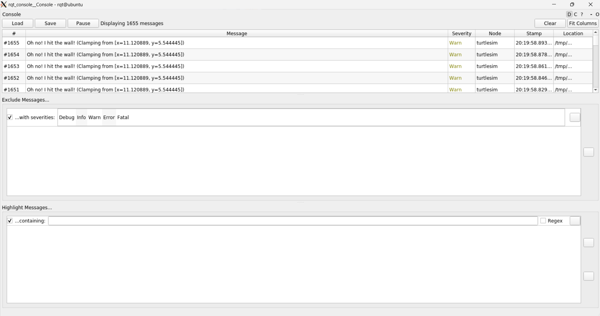

# Important commands/information for ROS2 (Linux)

<h2>Starting from personal PC</h2>

When starting the ROS2 you will need to ssh into the raspberry pi from a personal pc via this command
```
#ssh ubuntu@CURRENT_RASPBERRYPI_IP_ADDRESS

#in my case
ssh ubuntu@10.0.0.25
```
when enabling X11 do this command:
```
ssh -X ubuntu@10.0.0.25 (with your current raspberry pi ip address of course)
```

Doing this will then give you a prompt for the password to the pi, the password is: robotics101
<h2>Sourcing the setup files: </h2>  

```
source /opt/ros/foxy/setup.bash
```

**(optional/necessary)** adding to sheet startup script: (Note: if need to remove, locate startup script file)
```
echo "source /opt/ros/foxy/setup.bash" >> ~/.bashrc
```

<h2> Check environment variables </h2>

```
printenv | grep -i ROS
```

When doing this you should see the following:

```
ROS_VERSION=2
ROS_PYTHON_VERSION=3
ROS_DISTRO=foxy
```


The `ROS_DOMAIN_ID` variable:

```
export ROS_DOMAIN_ID=<your_domain_id>
```
When it comes to the ID its specified to keep things in the range between 0 and 101 inclusivly. 

**(optional/necessary)** Adding to sheet to startup script: (Note: if need to remove, locate startup script file)
```
echo " export ROS_DOMAIN_ID=<your_domain_id>" >> ~/.bashrc
```

The `ROS_LOCALHOST_ONLY` variable:  
```
export ROS_LOCALHOST_ONLY=1
```
This variable allows you to limit the ROS 2 communication to localhost only. This means your ROS 2 system, and its topics, services, and actions will not be visible to other computers on the local network.

**(optional/necessary)** Adding to sheet to startup script: (Note: if need to remove, locate startup script file)

```
echo "export ROS_LOCALHOST_ONLY=1" >> ~/.bashrc
```

<h3>Note: </h3>

When needing to remove a given command within .bashrc you will need to go into that file via these commands:

```
#for locating the file
ls -a

#for entering into the file
vi .bashrc
```

Important commands when editing a file:

```
i: for inserting

esc: for getting out of inserting

Shift ZZ: for saving the file and quickly exiting out of the file

:q! -> for exiting the file without saving
```

Important command when exiting an environment:
```
To exit an environment properly ALWAYS do ctrl + C
```

<h1> Important for using TurtleSim </h1>

Turtlesim is a visual platform that is used for testing purposes when you want to see visually what will happen with your robot. The issue though when using turtlesim is that it requires you to have a pre installed GUI that can be used between your current machine and your ubuntu machine running on your Raspberry pi. Thus meaning you need to make sure you have a gui installed. Follow these instructions on this site in order to gain the prerequisites for setting up the turtlesim correctly:
https://docs.ros.org/en/foxy/Tutorials/Beginner-CLI-Tools/Introducing-Turtlesim/Introducing-Turtlesim.html

If you reached this point in the tutorial, and obtained the error instead of the screen then this is where I tell you in how to fix the issue:

```
#When running this you will either obtain a message or the display screen with the turtle:
ros2 run turtlesim turtlesim_node
```
Now how will you fix this issue you may ask? Well the simple answer is that you need to install a GUI for the Windows SubSystem of Linux since Linux doesn't have a built in version. You will need to download Xming or VcXsrv

I downloaded Xming so here is the site to it:
http://www.straightrunning.com/XmingNotes/

once you have that installed you will need to open it, it will be called Xlaunch. Click `next` till you reach *extra settings*. When your in extra settings click `Disable access control`, this will allow you access to use Xming from any machine/client which is necessary for running any type of visual software on your ubuntu machine through your windows machine.

after accomplishing this you will then need to go into your ubuntu machine, when inside you will need to open your `.bashrc` file when inside you will need to include this:

```
#Display for running any visual client and other forms of software
export DISPLAY=YOUR_IP_ADDRESS_ON_CURRENT_MACHINE:0

#Example
export Display=10.0.0.245:0  #No spaces
```

once you have accomplished this save the file and exit it, restart your environment by closing out and reopening the command prompt and sshing again. 

Now without any further a due rerun the specific turtlesim line above to see the turtle on the screen. You will be amazed by its gracefulness.


<h2>Testing TurtleSim </h2>
now to test if turtle sim is working correctly, you will need to input this same command in one terminal:

```
ros2 run turtlesim turtlesim_node
```

then in a seperate terminal you will need to input this command:
```
ros2 run turtlesim turtle_teleop_key
```

When doing this it will allow you to control the terminal within the display window with the arrow keys when currently in the terminal where you inputted that command.

<h2>rqt_graph</h2>
rqt graph will display the given information about the nodes and the topics that are currently being played with:


the rectangles are the topics, and the ovals are the nodes.
nodes will send messages through services which will be passed down through topics in which those topics will send those messages to other nodes.

rqt graph is a helpful tool to see how your nodes interact with one another. This will be beneficial when you visually need to see what is happening with your robotic system.


<h2>Services</h2>
Nodes can communicate using services in ROS 2. Unlike a topic - a one way communication pattern where a node publishes information that can be consumed by one or more subscribers - a service is a request/response pattern where a client makes a request to a node providing the service and the service processes the request and generates a response.

You generally don’t want to use a service for continuous calls; topics or even actions would be better suited.<br>

Important service commands:

```
#important commands:

ros2 service list

ros2 service find <type_name> 

EXAMPLE: ros2 service find std_srvs/srv/Empty

ros2 interface show <type_name>.srv

EXAMPLE: ros2 interface show std_srvs/srv/Empty.srv

ros2 service call <service_name> <service_type> <arguments>

EXAMPLE: ros2 service call /spawn turtlesim/srv/Spawn "{x: 2, y: 2, theta: 0.2, name: ''}"
```

NOTE: when passing in arguments for most of these services, topics, etc. You need to always write it in YAML format. Similar to JSON format or HTML format.

<h2> Important Notes: </h2>

**Parameters**: is a configuration value of a node, think of them as node settings<br>
* can store parameters as integers, floats, booleans, strings, and lists.
* each node maintains it's own parameters.

```
#to check parameter lists do this:
ros2 param list

#to determine a parameter's type, you can use: 
ros2 param get <node_name> <parameter_name>

EXAMPLE:
ros2 param get /turtlesim background_g

#To change a parameters value at runtime, use the command:
ros2 param set <node_name> <parameter_name> <value>

EXAMPLE:
ros2 param set /turtlesim backgroun_r 150

#These values will only show up in your current session, but you can save them so they can show up in every session via this command:
ros2 param dump <node_name>

EXAMPLE:
ros2 param dump /turtlesim

#You can load parameters from afile to a currently running node using the command:
ros2 param load <node_name> <parameter_file>

EXAMPLE:
ros2 param load /turtlesim ./turtlesim.yaml

#To startthesame node using your saved parameter values, use:
ros2 run <package_name> executable_name> --ros-args --params-file <file_name>

EXAMPLE:
ros2 run turtlesim turtlesim_node --ros-args --params-file ./turtlesim.yaml
```

<h2> Actions </h2> 
Actions are quite easy to learn and I believe it's best to read the whole tutorial of it to understand it fully:

Actions are one of the communication types in ROS 2 and are intended for long running tasks. They consist of three parts: a goal, feedback, and a result.

https://docs.ros.org/en/foxy/Tutorials/Beginner-CLI-Tools/Understanding-ROS2-Actions/Understanding-ROS2-Actions.html


<h2>RQT Console</h2>

This will be very useful and handy to know whether there is an issue with our robot:

```
#Command to open the console:
ros2 run rqt_console rqt_console
```


The loggers level of severity is ordered in this manner:
There is no exact standard for what each level indicates, but it’s safe to assume that:

* `Fatal` messages indicate the system is going to terminate to try to protect itself from detriment.

* `Error` messages indicate significant issues that won’t necessarily damage the system, but are preventing it from functioning properly.

* `Warn` messages indicate unexpected activity or non-ideal results that might represent a deeper issue, but don’t harm functionality outright.

* `Info` messages indicate event and status updates that serve as a visual verification that the system is running as expected.

* `Debug` messages detail the entire step-by-step process of the system execution.
<br>
<br>

`rqt_console` can be very helpful if you need to closely examine the log messages from your system. You might want to examine log messages for any number of reasons, usually to find out where something went wrong and the series of events leading up to that.

<h2>Recording and playing back data</h2>
To record the data published to a topic use the command syntax:

```
ros2 bag record <topic_name>

#EXAMPLE:
ros2 bag record /turtle1/cmd_vel
```

When you are done recording do `ctrl + C`

Recording multiple topics:

```
ros2 bag record -o subset /turtle1/cmd_vel /turtle1/pose
```

`-o` allows you to choose a unique name for the bag
`subset` is the name of the bag you are choosing.

You can record data passed on topics in your ROS 2 system using the ros2 bag command. Whether youre sharing your work with others or introspecting your own experiments, its a great tool to know about.

There are more commands and information found on the wiki and the documentation page.
